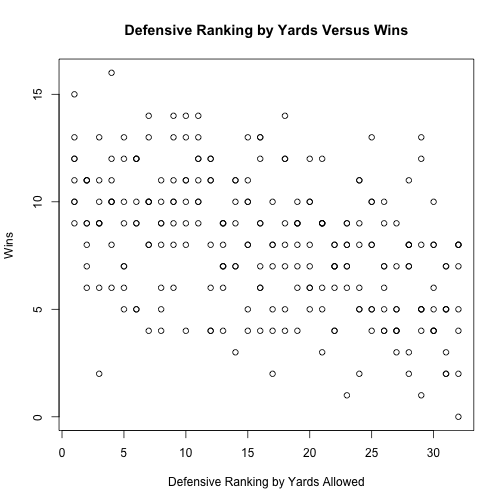
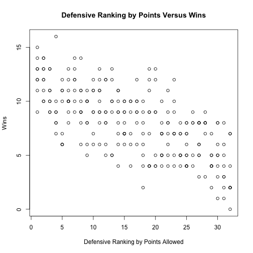
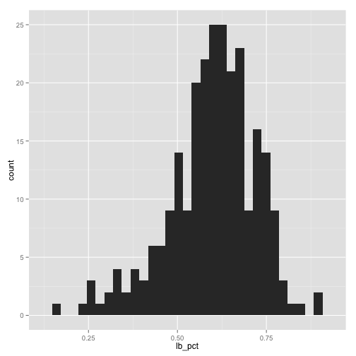
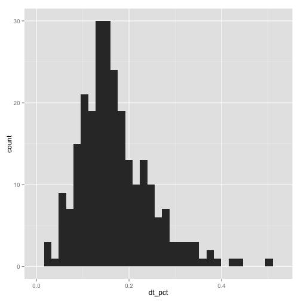
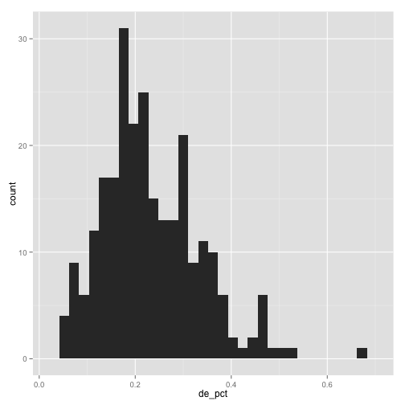
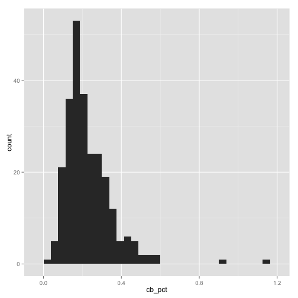
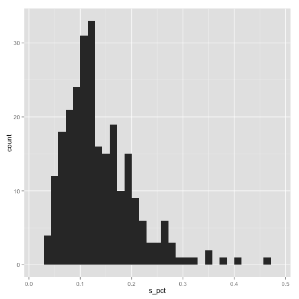

# Chris Fenton Summer Bridge Final Project
## Part II: NFL Data Analysis

[Github Repo](https://github.com/cjf4/Summer-Bridge-Assignments/tree/master/Final%20Project)

First, I loaded the .csv file [I prepared earlier](http://rpubs.com/cjf4/97449).


```r
library(ggplot2)

nfl <- read.csv('salary_season.csv', stringsAsFactors=FALSE)
```

There's still a little bit more wrangling I want to do before I start doing explatory data analysis. It turned out the data from USA Today had a few more problems than I initially realized.

### Will, Mike, Sam, or Jack?

The first problem was somewhat easy to overcome. The salary data sometimes listed a player as linebacker, sometimes as an outside linebacker, and sometimes as a middle linbacker. 

This is actually a classification problem that is common to NFL data due to the different roles a linebacker can play depending on the scheme. Some linebackers almost always cover receivers on passing downs, where as others (especially in a 3-4 scheme) do nothing but rush the quarterback. 

For simplicity's sake, I chose to ignore those differences and simply combine all these vectors into a single total linebacker vector.


```r
total_lbs <- nfl[,'LB.Cost'] + nfl[,'OLB.Cost'] + nfl[,'MLB.Cost']
nfl <- cbind(nfl, tLB.Cost = total_lbs)
```
### Linemen are people too, but someone forgot to tell the USA Today

The next problem was quite a bit more serious, and required me to adjust my approach. When writing my sql query to create the CSV file, I noticed something odd. The Jacksonville Jaguars apparently did not have any offensive linemen on payroll in 2009.

As much as that may make sense to a football fan who's familiar with the Jaguars, further inspection revealed that only 2005 for any team included any offensive linemen. My original plan was to measure each team's proportion of total salary allocated to each position group. But with offensive line data most missing, this wouldn't be accurate at all.

To still salvage something of value, I decided to tighten my scope on what I did have, which were salaries for all the defensive players (I double checked to see if safeties were in there because fool me twice...).

So I added up all the vectors for defensive position groups to come up with a column in the data frame that had the total amount a team spent on defense in a given year:

```r
total_d <- nfl[,'tLB.Cost'] + nfl[,'DE.Cost'] + nfl[,'DT.Cost'] 
                            + nfl[,'CB.Cost'] + nfl[,'S.Cost']
```

```
##   [1] 20987608 14206291  8679487 21157531 23600075  8684938 14391218
##   [8] 24410246 11308507  8616419 19596532 15407654 19935396 25779113
##  [15]  8796763 15945772 12245098 22618265 15781961 22450314 13313262
##  [22] 12954835 14900766 16735721 22487912 21477897 14697516 15229005
##  [29] 19912717 20219778 20160020 19737054 27806607 29177786  7896817
##  [36] 12742179 22618808  9823661 14665919 18316282 12681959 12871118
##  [43] 15090312 22102221 14785242 22788382  9885032 11979860 22240018
##  [50] 12896885 14382422 14231055 11965745 11167844 19843002 12692831
##  [57] 23975097 17253753 17156840 13999025 17880023 15142973 16843827
##  [64] 20191789 23123427 22453745  9595202 12358932 17393155 13901603
##  [71] 16556039 16609767 16533088 21826804  6405068 16810645 12362656
##  [78]  9499616 11991751  8379200 12236661 12192944 12664917 13352810
##  [85] 13165816 19902083 13015073  9448309 20911311 19445232 19911414
##  [92]  9929464 15469347  9791338 15069660 13807025  8568090 15200427
##  [99] 15744195 16050921 16903193 16426797 16004314 14669164 17636600
## [106] 14849571  6935506 21514791  8508724 16193033 13467389  8821334
## [113] 18562604  9210125 15305234 14739927 12981412  9963318 10353101
## [120] 12385620 19494041 14791984 22616973 10237859 10309964  8473463
## [127] 12567285 16993945 10842796 12400871 11607735 14872762 11754660
## [134] 10646451 12619122 10772309  9832626 15115870  6556901 13441464
## [141] 13943431 11250029 10839310 12667534 13402042  8595301 14657582
## [148]  7556264 12291319 10550992 17701048  7634065 13215667 13166453
## [155] 12708738  8164599  8692539 10383465  7587683 26153211  6739646
## [162] 14912636  9626294 12315075  9158864 12931480 10582632 13940278
## [169]  7755277 12255008  6487615 12309258 19027031  9926182 10531929
## [176] 11201081 11576674  8347605 14515123 15194650 11630364 16580996
## [183] 16042988  8572084 10060676  9878832 11729333  8766521 11744943
## [190] 17489554 16023270 25825279  7050207 13659826  9134057  9237433
## [197]  4508769  9185975 10941964 12573976  6419681 11704060  6218695
## [204] 10549681 19946284 18646424 13178608  7654471  8860631  7902861
## [211]  8057549 10406741  8737210 13574126 11185200 10134474 11108132
## [218]  8176132 10519078 10087032 15311359 12705204  9525908  9287822
## [225]  6915739 10301812  6688331  5864737  7910314  9391170  7674219
## [232] 10847175 12120177 11529080  5246093  6687884 13889167 14503126
## [239] 11790732  7327550  6863460  6747058  6388537 10433753  6117091
## [246] 12213647 11370327  8538749  5622953  9206879  5192823 14378545
## [253] 12436696 19709006  8474167  3768313
```

```r
nfl <- cbind(nfl, tD.Cost = total_d)
```

### It's all relative

Here I simply took my position group totals from earlier and determined the ratio of total defensive money spent.

```r
lb_pct <- nfl[,'tLB.Cost'] / nfl[,'tD.Cost']  
dt_pct <- nfl[,'DT.Cost'] / nfl[,'tD.Cost']  
de_pct <- nfl[,'DE.Cost'] / nfl[,'tD.Cost']  
cb_pct <- nfl[,'CB.Cost'] / nfl[,'tD.Cost']  
s_pct <- nfl[,'S.Cost'] / nfl[,'tD.Cost']  

nfl <- cbind(nfl, lb_pct, dt_pct, de_pct, cb_pct, s_pct)
```

And before I started running any analysis, I cut the data down to a smaller frame that only included the propotion numbers and the performance data that could be impacted by defense peformance.

```r
def <- subset(nfl,select=c("team_name",
                           "year",
                           "Wins",
                           "Points.Against",
                           "Def.Rank.Pts",
                           "Def.Rank.Yds",
                           "lb_pct",
                           "dt_pct",
                           "de_pct",
                           "cb_pct",
                           "s_pct"))
```

### Yards or Points?

First, I just wanted to see if NFL tradition of ranking NFL defenses by yards allowed was really a better measure than points against.

Here's the plot by yards ranking:

```r
plot(def$'Def.Rank.Yds', def$'Wins', main ="Defensive Ranking by Yards Versus Wins", xlab="Defensive Ranking by Yards Allowed", ylab="Wins")
```

 
And the plot for points ranking:

```r
plot(def$'Def.Rank.Pts', def$'Wins', main ="Defensive Ranking by Points Versus Wins", xlab="Defensive Ranking by Points Allowed", ylab="Wins")
```

 

Looked to me like ranking by points is a better indicator. I checked out the correlations to confirm this:


```r
cor(def$'Def.Rank.Yds', def$Wins)
```

```
## [1] -0.4504027
```

```r
cor(def$'Def.Rank.Pts', def$Wins)
```

```
## [1] -0.669541
```
Sure enough, the correlation to wins is considerably stronger for points allowed than it is yards (the correlations are negative because the rankings are inverted, ie 1 is the best, 32 is the worst).

However, in order to totally accept this conclusion, I would need to confirm that the "Points Allowed" data provided by Pro Football Reference only included points actually given up by the defense (as opposed to special teams touchdowns or pick sixes, which increase a team's total points allowed but not that of the defense). 

### How do teams allocate their defensive budgets?

I was also generally curious how teams split up their defense budgets. This was very easy to see using the summary() function:


```r
summary(def[,7:11])
```

```
##      lb_pct           dt_pct            de_pct            cb_pct       
##  Min.   :0.1675   Min.   :0.02181   Min.   :0.04404   Min.   :0.03735  
##  1st Qu.:0.5387   1st Qu.:0.11743   1st Qu.:0.16472   1st Qu.:0.15108  
##  Median :0.6117   Median :0.15785   Median :0.21490   Median :0.19289  
##  Mean   :0.5976   Mean   :0.16963   Mean   :0.23281   Mean   :0.22932  
##  3rd Qu.:0.6796   3rd Qu.:0.20804   3rd Qu.:0.30204   3rd Qu.:0.28582  
##  Max.   :0.9039   Max.   :0.50078   Max.   :0.66488   Max.   :1.16359  
##      s_pct        
##  Min.   :0.03005  
##  1st Qu.:0.09039  
##  Median :0.12067  
##  Mean   :0.13761  
##  3rd Qu.:0.17084  
##  Max.   :0.45880
```

I also wanted a visualization of what kind of variability existed for each position group:


```r
ggplot(data = def) +geom_histogram(aes(x = lb_pct))
```

```
## stat_bin: binwidth defaulted to range/30. Use 'binwidth = x' to adjust this.
```

 

```r
ggplot(data = def) +geom_histogram(aes(x = dt_pct))
```

```
## stat_bin: binwidth defaulted to range/30. Use 'binwidth = x' to adjust this.
```

 

```r
ggplot(data = def) +geom_histogram(aes(x = de_pct))
```

```
## stat_bin: binwidth defaulted to range/30. Use 'binwidth = x' to adjust this.
```

 

```r
ggplot(data = def) +geom_histogram(aes(x = cb_pct))
```

```
## stat_bin: binwidth defaulted to range/30. Use 'binwidth = x' to adjust this.
```

 

```r
ggplot(data = def) +geom_histogram(aes(x = s_pct))
```

```
## stat_bin: binwidth defaulted to range/30. Use 'binwidth = x' to adjust this.
```

 

With the graphs, it's a bit easier to see what's going on. Most striking to me is the variance that exists within the defensive end grouping. The interquartile range is the largest of the 5 position groups measured.

### K-Nearest Neighbors Algorithm
When I originally set out with this project, I wanted to use the "K-Nearest Neighbors" algorithm to detect patterns in the way general managers (the person in charge of acquiring players) structure their teams, and to see how those patterns compared in terms of success (wins and playoff appearances).

My understanding, which is very much nascent at this point, is you begin with a multi dimensional matrix, and choose a "K" number of features to define a record. You than pick an aribitrary number of points that will eventually define your patterns. Finally, the algorithm creates a vector for each point that attempts to guess points that will be the closest to grouping of vectors, using euclidian distance. It continues to guess, using past performance to improve it's guesses, until a satisfactorily small distance is achieved for all the vectors.

My strategy to implement this using NFL data would be to use the 5 position group budget allocation percentages and wins as vector elements, and use maybe 3 or 4 nearest neighbor points to look for

My thoughts as to why this would be a good fit for salary data is that the K-Features are already all percentages, thus avoiding the scaling problems that the K-Nearest Neighbors can be prone to. 

Also, if successful, it would be easy to measure the success of each  of each nearest neighbor point, as they would all have different win values. Than, you would have a template you could conceivably give back to a general manager and say "This pattern is much more associated with success than the others."

